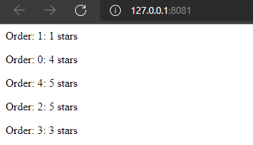

# Network Programming 
Laboratory N1. Restaurant Simulator. Kitchen

## Table of contents
* [Description](#description)
* [Technologies](#technologies)

## Description
This repository represents a draft of my "hardwork" in creating a server and a Docker image of the Kitchen. 
The code generates order and sends them as array structure

In the ```kitchen.py``` file we have 2 classes: ```Kitchen``` and ```Cook```. When we construct the ```Kitchen``` in ```main.py```, it calls the constructors of ```Cook```.

The ```Cook``` class has information about the ```cook_id```, its ```rank```, ```proficiency```, ```name``` and ```catch_phrase```

```py
class Cook:
    def __init__(self, cook_id, rank, proficiency, name, catch_phrase):
        self.id = cook_id
        self.rank = rank
        self.proficiency = proficiency
        self.name = name
        self.catch_phrase = catch_phrase
```
All the information about the cooks it is stored in ```cooks.json```. An example of a cook dict is the following:

```json
{
  "rank": 1,
  "proficiency": 1,
  "name": "Paul Bocuse",
  "catch-phrase": "Without butter, without eggs, there is no reason to come to France."
  }
```

In the ```Kitchen``` class, we construct a list of cooks, which respectively calls the constructor from ```Cook``` class, also we take in consideration the number of stoves and ovens and the menu from ```foods.json```.

The ```n_cooks``` gives us the information about how many dishes can be cooked when all the cooks are free.

The ```cooking()``` method cooks the food, therefore it gives the ```preparation-time``` from the json file.
```py
def cooking(self, food_id):
    time.sleep(self.menu[food_id-1]['preparation-time'])
```

Python threads are a form of parallelism that allow your program to run multiple procedures at once. Parallelism in Python can also be achieved using multiple processes, but threads are particularly well suited to speeding up applications that involve significant amounts of I/O (input/output).

The ```concurrent.futures``` module from python provides a high-level interface for asynchronously executing callables.

```ThreadPoolExecutor``` is an ```Executor``` subclass that uses a pool of threads to execute calls asynchronously. The second and possibly most popular method of instantiating a ```ThreadPoolExecutor``` is using it as a context manager like so:

```py
with futures.ThreadPoolExecutor(self.n_cooks) as executor:
```
Here we instantiate an instance of our `ThreadPoolExecutor` and pass in the maximum number of cooks that we want it to have. In this case we’ve defined it as ```n_cooks``` which essentially means this thread pool will only have 7 (in our case), concurrent threads that can process any jobs that we submit to it.

In order to give the threads within our ThreadPoolExecutor something to do we can call the ```submit()``` function which takes in a function as its primary parameter like so:

```py
future = executor.submit(self.cooking, food)
```
The ```.result(timeout=None``` returns the value returned by the call. If the call hasn’t yet completed then this method will wait up to ```timeout``` seconds.


Also in ```main.py```, we have a method called ```order()```, which prepares the food and makes a request with POST method to the dinning hall, which contains a json of the prepared food. 



## Technologies
* IDE : Visual Studio Code
* Programming language : Python
* Additional software used in project: Docker